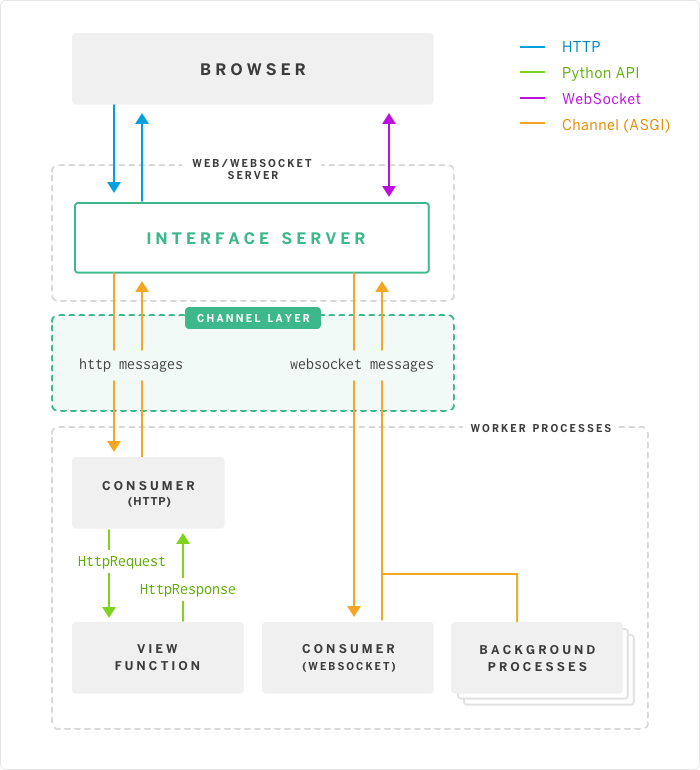

# Django Channels

## Introduction

### What is Channels?

Channels extends Django to add [a new layer](https://channels.readthedocs.io/en/stable/concepts.html#what-are-channels) that allows two important features:

- WebSocket handling, in a way very [similar to normal views](https://channels.readthedocs.io/en/stable/getting-started.html#websocket-example)
- Background tasks, running in the same servers as the rest of Django

<!--more-->

### How?

It separates Django into two process types:

- One that handles HTTP and WebSockets
- One that runs views, websocket handlers and background tasks (*consumers*)

### I have to change how I run Django?

- An ASGI server, probably [Daphne](http://github.com/django/daphne/)
- Django worker servers, using `manage.py runworker`
- Something to route ASGI requests over, like Redis.

Even when you’re running on Channels, it routes all HTTP requests to the Django view system by default, so it works like before.

## Concepts

Django’s traditional view of the world revolves around requests and responses

It changes the way Django runs to be “event oriented” - rather than just responding to requests

### What is a channel?

It is an *ordered*, *first-in first-out queue* with *message expiry* and *at-most-once delivery* to *only one listener at a time*.

There are a couple of other limitations - messages must be made of serializable types, and stay under a certain size limit - but these are implementation details you won’t need to worry about until you get to more advanced usage.

Inside a network, we identify channels uniquely by a name string - you can send to any named channel from any machine connected to the same channel backend. If two different machines both write to the `http.request` channel, they’re writing into the same channel.

### How to use channels?

Inside Django you can write a function to consume a channel:

```python
def my_consumer(message):
    pass
```

And then assign a channel to it in the channel routing:

```python
channel_routing = {
    "some-channel": "myapp.consumers.my_consumer",
}
```

This means that for every message on the channel, Django will call that consumer function with a message object (message objects have a “content” attribute which is always a dict of data, and a “channel” attribute which is the channel it came from, as well as some others).

Channels changes Django so that it runs in a worker mode - it listens on all channels that have consumers assigned, and when a message arrives on one, it runs the relevant consumer.

. So rather than running in just a single process tied to a WSGI server, Django runs in three separate layers:

- Interface servers, which communicate between Django and the outside world. This includes a WSGI adapter as well as a separate WebSocket server - this is explained and covered in [Run interface servers](https://channels.readthedocs.io/en/stable/deploying.html#run-interface-servers).
- The channel backend, which is a combination of pluggable Python code and a datastore (e.g. Redis, or a shared memory segment) responsible for transporting messages.
- The workers, that listen on all relevant channels and run consumer code when a message is ready.



The interface servers transform connections from the outside world (HTTP, WebSockets, etc.) into messages on channels, and then you write workers to handle these messages. Usually you leave normal HTTP up to Django’s built-in consumers that plug it into the view/template system, but you can override it to add functionality if you want.

```python
# Listens on http.request
def my_consumer(message):
    # Decode the request from message format to a Request object
    django_request = AsgiRequest(message)
    # Run view
    django_response = view(django_request)
    # Encode the response into message format
    for chunk in AsgiHandler.encode_response(django_response):
        message.reply_channel.send(chunk)
```

### Channel Types

There are actually two major uses for channels in this model. 

* The dispatching of work to consumers - a message gets added to a channel, and then any one of the workers can pick it up and run the consumer.
* The second kind of channel, however, is used for replies. Notably, these only have one thing listening on them - the interface server. Each reply channel is individually named and has to be routed back to the interface server where its client is terminated.

a *reply channel* by having the channel name contain the character `!` - e.g. `http.response!f5G3fE21f`. *Normal channels* do not contain it, but along with the rest of the reply channel name, they must contain only the characters `a-z A-Z 0-9 - _`, and be less than 200 characters long.

### Group

Channels implements this abstraction as a core concept called Groups:

```python
@receiver(post_save, sender=BlogUpdate)
def send_update(sender, instance, **kwargs):
    Group("liveblog").send({
        "text": json.dumps({
            "id": instance.id,
            "content": instance.content
        })
    })

# Connected to websocket.connect
def ws_connect(message):
    # Add to reader group
    Group("liveblog").add(message.reply_channel)
    # Accept the connection request
    message.reply_channel.send({"accept": True})

# Connected to websocket.disconnect
def ws_disconnect(message):
    # Remove from reader group on clean disconnect
    Group("liveblog").discard(message.reply_channel)
```

Groups are generally only useful for reply channels (ones containing the character `!`), as these are unique-per-client, but can be used for normal channels as well if you wish.

## Start with Channels

### First Consumers

let’s write a consumer that overrides the built-in handling and handles every HTTP request directly.

```python
from django.http import HttpResponse
from channels.handler import AsgiHandler

def http_consumer(message):
    # Make standard HTTP response - access ASGI path attribute directly
    response = HttpResponse("Hello world! You asked for %s" % message.content['path'])
    # Encode that response into message format (ASGI)
    for chunk in AsgiHandler.encode_response(response):
        message.reply_channel.send(chunk)
```

> The most important thing to note here is that, because things we send in messages must be JSON serializable, the request and response messages are in a key-value format.

> There’s an `AsgiRequest` class that translates from ASGI into Django request objects, and the `AsgiHandler` class handles translation of `HttpResponse` into ASGI messages, which you see used above. Usually, Django’s built-in code will do all this for you when you’re using normal views.

Tell Django that this consumer should be tied to the `http.request` channel rather than the default Django view system.

```python
# In settings.py
CHANNEL_LAYERS = {
    "default": {
        "BACKEND": "asgiref.inmemory.ChannelLayer",
        "ROUTING": "myproject.routing.channel_routing",
    },
}
```

> This example, and most of the examples here, use the “in memory” channel layer. This is the easiest to get started with but provides absolutely no cross-process channel transportation, and so can only be used with `runserver`. You’ll want to choose another backend (discussed later) to run things in production.

```python
# In routing.py
from channels.routing import route
channel_routing = [
    route("http.request", "myapp.consumers.http_consumer"),
]
```

If you start up `python manage.py runserver` and go to `http://localhost:8000`, you’ll see that, rather than a default Django page, you get the Hello World response

make this WebSocket consumer instead:

```python
# In consumers.py

def ws_message(message):
    # ASGI WebSocket packet-received and send-packet message types
    # both have a "text" key for their textual data.
    message.reply_channel.send({
        "text": message.content['text'],
    })
```

Hook it up to the `websocket.receive` channel like this:

```python
# In routing.py
from channels.routing import route
from myapp.consumers import ws_message

channel_routing = [
    route("websocket.receive", ws_message),
]
```

You should see an alert come back immediately saying “hello world” - your message has round-tripped through the server and come back to trigger the alert.

### Group

we’ll use Groups, one of the [core concepts](https://channels.readthedocs.io/en/stable/concepts.html) of Channels, and our fundamental way of doing multi-cast messaging.

We’ll hook up the `websocket.connect` and `websocket.disconnect` channels to add and remove our clients from the Group as they connect and disconnect, like this:

```python
 # In consumers.py
from channels import Group

# Connected to websocket.connect
def ws_add(message):
    # Accept the connection
    message.reply_channel.send({"accept": True})
    # Add to the chat group
    Group("chat").add(message.reply_channel)

# Connected to websocket.receive
def ws_message(message):
    Group("chat").send({
        "text": "[user] %s" % message.content['text'],
    })

# Connected to websocket.disconnect
def ws_disconnect(message):
    Group("chat").discard(message.reply_channel)
```

> You need to explicitly accept WebSocket connections if you override connect by sending `accept: True` - you can also reject them at connection time, before they open, by sending `close: True`.

Channels added to groups expire out if their messages expire (every channel layer has a message expiry time, usually between 30 seconds and a few minutes, and it’s often configurable) - but the `disconnect` handler will get called nearly all of the time anyway.

And what our routing should look like in `routing.py`:

```python
from channels.routing import route
from myapp.consumers import ws_add, ws_message, ws_disconnect

channel_routing = [
    route("websocket.connect", ws_add),
    route("websocket.receive", ws_message),
    route("websocket.disconnect", ws_disconnect),
]
```

Run `runserver`, open a browser and use that same JavaScript code in the developer console as before

```javascript
// Note that the path doesn't matter right now; any WebSocket
// connection gets bumped over to WebSocket consumers
socket = new WebSocket("ws://" + window.location.host + "/chat/");
socket.onmessage = function(e) {
    alert(e.data);
}
socket.onopen = function() {
    socket.send("hello world");
}
// Call onopen directly if socket is already open
if (socket.readyState == WebSocket.OPEN) socket.onopen();
```

### Running with Channels ?

Because Channels takes Django into a multi-process model, you no longer run everything in one process along with a WSGI server

There are multiple kinds of “interface servers”, and each one will service a different type of request - one might do both WebSocket and HTTP requests, while another might act as an SMS message gateway, for example.

By default, Django doesn’t have a channel layer configured

In the example above we used the in-memory channel layer implementation as our default channel layer. This just stores all the channel data in a dict in memory, and so isn’t actually cross-process; it only works inside `runserver`, as that runs the interface and worker servers in different threads inside the same process. When you deploy to production, you’ll need to use a channel layer like the Redis backend `asgi_redis` that works cross-process; see [Channel Layer Types](https://channels.readthedocs.io/en/stable/backends.html) for more.

### Persisting Data

Channels provides a `channel_session` decorator for this purpose - it provides you with an attribute called `message.channel_session` that acts just like a normal Django session.

```python
# In consumers.py
import json
from channels import Group
from channels.sessions import channel_session
from urllib.parse import parse_qs

# Connected to websocket.connect
@channel_session
def ws_connect(message, room_name):
    # Accept connection
    message.reply_channel.send({"accept": True})
    # Parse the query string
    params = parse_qs(message.content["query_string"])
    if b"username" in params:
        # Set the username in the session
        message.channel_session["username"] = params[b"username"][0].decode("utf8")
        # Add the user to the room_name group
        Group("chat-%s" % room_name).add(message.reply_channel)
    else:
        # Close the connection.
        message.reply_channel.send({"close": True})

# Connected to websocket.receive
@channel_session
def ws_message(message, room_name):
    Group("chat-%s" % room_name).send({
        "text": json.dumps({
            "text": message["text"],
            "username": message.channel_session["username"],
        }),
    })

# Connected to websocket.disconnect
@channel_session
def ws_disconnect(message, room_name):
    Group("chat-%s" % room_name).discard(message.reply_channel)
```

Update `routing.py` as well:

```python
# in routing.py
from channels.routing import route
from myapp.consumers import ws_connect, ws_message, ws_disconnect

channel_routing = [
    route("websocket.connect", ws_connect, path=r"^/(?P<room_name>[a-zA-Z0-9_]+)/$"),
    route("websocket.receive", ws_message, path=r"^/(?P<room_name>[a-zA-Z0-9_]+)/$"),
    route("websocket.disconnect", ws_disconnect, path=r"^/(?P<room_name>[a-zA-Z0-9_]+)/$"),
]
```

### Authentication

Handily, as WebSockets start off using the HTTP protocol, they have a lot of familiar features, including a path, GET parameters, and cookies. We’d like to use these to hook into the familiar Django session and authentication systems; after all, WebSockets are no good unless we can identify who they belong to and do things securely.

### Security

### Routing

### Models

### Enforcing Ordering

Because Channels is a distributed system that can have many workers, by default it just processes messages in the order the workers get them off the queue. It’s entirely feasible for a WebSocket interface server to send out two `receive` messages close enough together that a second worker will pick up and start processing the second message before the first worker has finished processing the first.

This is particularly annoying if you’re storing things in the session in the one consumer and trying to get them in the other consumer - because the `connect` consumer hasn’t exited, its session hasn’t saved. You’d get the same effect if someone tried to request a view before the login view had finished processing, of course, but HTTP requests usually come in a bit slower from clients.

Channels has a solution - the `enforce_ordering` decorator. All WebSockets messages contain an `order` key, and this decorator uses that to make sure that messages are consumed in the right order. In addition, the `connect` message blocks the socket opening until it’s responded to, so you are always guaranteed that `connect` will run before any `receives` even without the decorator.

There’s a high cost to using `enforce_ordering`, which is why it’s an optional decorator.

